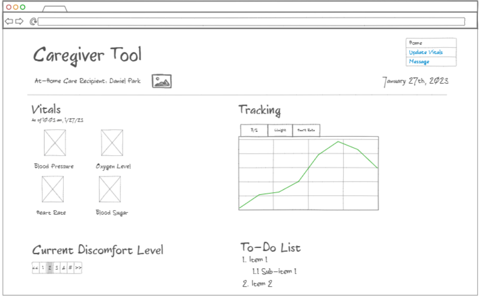
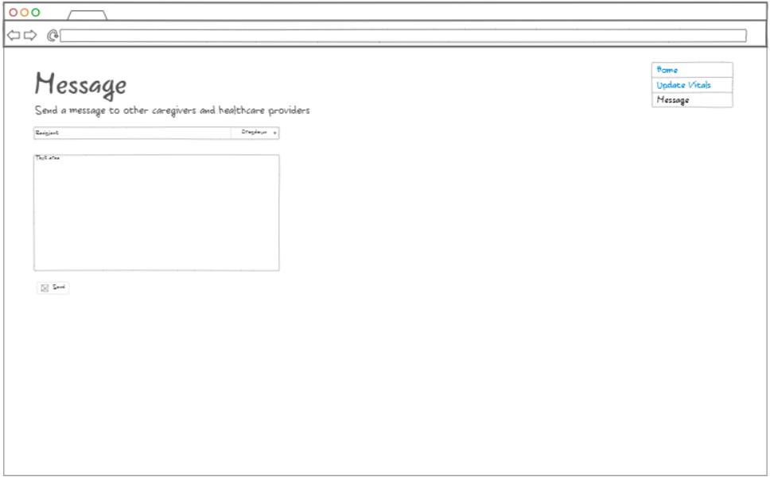

# Caregiver Tool

I am currently working as an at-home caregiver for an elderly family member. Caregiver Tool, my startup application, would allow at-home caregivers like me to record their patients' vitals, track their health over time using graphs, and message other caregivers/healthcare providers. The main page displays the patient's current vitals and historical graphs, and these statistics can be updated and recorded in the spreadsheet page. When issues arise, a doctor, at-home nurse, or fellow caregiver can be messaged and notified. 
### Home Page

### Update Vitals Page

### Message Page

Key features:
* Track patient vitals, including heart rate, B/S, B/P, oxygen level
* Display graphs of historical data
* Pain level tracker
* To-do list for patient
* Record vitals on spreadsheets that update main page in real-time
* Message healthcare providers and other caregivers

Notes about console assignment: 
This was a great experience. I learned a ton about repositories and cloning them to my computer. I learned how to push and pull changes. I learned how to edit my files using the console and GitHub. 
Steps to remember: git pull, git add ., git commit -m "(insert message)", git push
Also: check what directory with cmd and change directory with cd

Notes on Simon HTML project:
This project was a lot of fun and solidified my understanding with HTML structure, content, and layout. I had fun experimenting with different HTML elements. I also became a lot more comfortable with pushing my local development edits to my repository and constantly checking to make sure my progress was saved. I want to remember the console command: ./deployFiles.sh -k /keys/mykey.pem -h mydomain.click -s simon to deploy to my production environment. Head to simon.brysonon.com to check it out!

Notes on Simon CSS project:
Being able to finally stylize the website and customize it to my liking was very entertaining and fulfilling. I became much more comfortable with the use of CSS and its Bootstrap framework, and I learned a lot about flex containers and how to make your site responsive. You can set a container's display to flex (display: flex) and change the alignment of its child elements with flex-direction: column or row. Bootstrap can be used to simplify the process of making your site responsive and provides great formatting for buttons and texts.

Notes on startup application - HTML and CSS version:
I learned so much more about HTML and CSS through this project. I figured out just how helpful Bootstrap can be, as it heavily simplifies the coding that you need to do. With a little bit of documentation reading and CSS knowledge, you can easily create a site out of your ideas. I want to remember the link https://getbootstrap.com/docs/5.3/getting-started/introduction/ which provides all of the Bootstrap documentation. 

Notes on Simon JavaScript project:
Implementing JavaScript into the simon project has been my favorite implementation so far. This is because it has made the application fully operational, and the game can now be played. The most useful feature of the application that I learned was the use of localStorage to instantiate Storage objects to store user information, such as the name and scores. I also learned that the querySelector() function could be used to select specific elements within HTML. This link: https://developer.mozilla.org/en-US/docs/Web/API is very useful because it details JavaScript that can be utilized for a variety of web APIs. 

Notes on startup application - JavaScript version:
I am very excited to release a functional website that serves its purpose. My favorite part about this assignment was my ability to connect my form with Google Sheets to create an updatable database with vital information. This is the most useful feature because the data can then be displayed with graphs. JavaScript's ability to manipulate the DOM and the use of JSON are two important features that I want to remember.

Notes on Simon Service project:
* Code for adding static file middleware: app.use(express.static('public'));
* Configure directory to work with node.js: npm init -y
* Create a .gitignore file to ignore unwanted files like node_modules
* Install express package: npm install express
* index.js file will be called by node.js for web service
* Basic JavaScript express code link: https://github.com/webprogramming260/.github/blob/main/profile/webServices/express/express.md
* Make calls to third-party endpoints using fetch: 
fetch('https://api.quotable.io/random')
    .then((response) => response.json())
    .then((data) => {
    //data goes here
});

Notes on Simon DB project:
* access production environment: ssh -i /location/to/key.pem ubuntu@mywebsiteurl.com
* alter both production environment and development environment variables to make database more secure
* install mongodb: npm install mongodb
* use pm2 restart all --update-env AND pm2 save after updating production environment variables

Notes on Simon Login project:
* Install all of the packages you will need: npm install express cookie-parser mongodb uuid bcrypt
* A service endpoint is a digital location (typically a URL) where API receives requests about a specific resource - provides location of resource on the server to a client
* use of authorization cookies to store authorization tokens for an authenticated user using secure, httpOnly, and sameSite
* creation of four different service endpoints: authCreate, authLogin, authLogout, and userGet
* use of Express router function called secureApiRouter that verifies authorization cookie is valid before passing requests to endpoints (all of the endpoints must pass through this function)

Notes on Simon WebSocket project:
* WebSocket connections are peer to peer where either party can efficiently send data at any time
* Send messages with the send function and receive messages with onmessage function
* Install WebSocket: npm install ws
* Can debug WebSocket connection with Chrome debugger -> Network tab -> Messages tab
* Non-secure HTTP non-secure WebSocket (ws) protocal that is represented by window.location.protocal variable; otherwise use secure WebSocket (wss)

Notes on Startup Service project:
* The most valuable thing I need to remember is to make sure to npm init -y and npm install all the necessary tools I need in the very beginning
* Take it one task at a time, whether that is creating a third-party service endpoint or configuring work with WebSocket. This way, you won't get burnt out.
* It is important to work in tiny increments so as to keep your mind fresh and continue to work on tackling each problem

Notes on Simon React project:
* Changing application from multi-page application to single-page application
* Refer to https://github.com/webprogramming260/.github/blob/main/profile/simon/simon-react/simon-react.md for steps converting to React 
* Install react bootstrap: npm install bootstrap react-bootstrap
* Convert all code to React components by copying over code and creating child components
* Create .env.local file in order to debug 